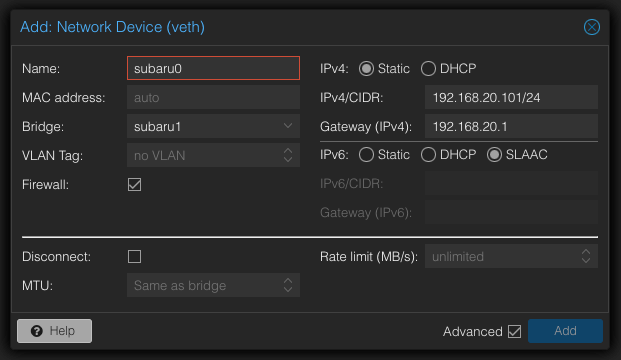

# Subaru cluster

k8s を動かす LXC コンテナで構築されたクラスターです。

## Setup

### 1. LXC Template(VMID 500)をコピー

souzou08のLXC Templateをコピーしてください。

### 2. LXCコンテナの設定

#### 2.1. SDNの設定

Datacenter > SDN > VNets > Create

Tagは空気を読んで変えてください。


Datacenter > SDN > VNets > Subnets > Create

SubnetのIPとGatewayはいい感じに変えてください。


#### 2.2. ネットワーク設定

LXC > Network > Add

BridgeとIP、Gatewayはいい感じに変えてください。



### 3. Proxmox VE の LXC の config を編集

`/etc/pve/lxc/{VMID}.conf`を編集

```config
lxc.apparmor.profile: unconfined
lxc.cap.drop:
lxc.cgroup.devices.allow: a
lxc.mount.auto: proc:rw sys:rw
```

### 4. ターミナルに入る

初期設定はユーザー`root`、パスワード`password`です。

#### 4.1. sshd の設定

```bash
dnf install openssh-server -y
sed -i 's/#PermitRootLogin prohibit-password/PermitRootLogin yes/' /etc/ssh/sshd_config
systemctl restart sshd
```

#### 4.2. ansible_user の作成

```bash
adduser ansible_user
echo "ansible_user ALL=(ALL) NOPASSWD: ALL" >> /etc/sudoers.d/ansible_user
mkdir -p /home/ansible_user/.ssh
echo "ssh-ed25519 AAAAC3NzaC1lZDI1NTE5AAAAIEtMsUY0MRNGCYCQ0PPm7XprDdTZgK6C6PyjhPVktTLZ" | tee /root/.ssh/authorized_keys /home/ansible_user/.ssh/authorized_keys
chown ansible_user:ansible_user -R /home/ansible_user/.ssh
```

### 5. DHCPの設定

このリポジトリの`/ansible/roles/dnsmasq/templates/dnsmasq.conf`を編集して、ホストと固定IPを設定してください。
