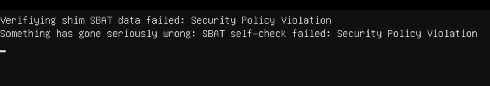

# オンプレ環境再起動復旧手順書

9/2 作成 @shiron-dev

## 概要

オンプレ環境の再起動時に発生する問題に対する復旧手順書です。
オンプレのステータスに関しては[Alive monitoring](https://info.shiron.dev/d/xtkCtBkiz/alive-monitoring?orgId=2&refresh=1m)を確認してください。

また、作業開始前に @shiron-dev にDiscordにてメンションをお願いします。

## 1. モニターをつける

PC、モニター、キーボードは全てナンバリングされ、ラベルが貼られています。
対象のモニターの電源を入れてください。

※モニターをつけずに再起動を行うと、永続的にモニターへの出力がされなくなる可能性があります(サーバー用OSの仕様)。そのため、必ずモニターをつけたのちに以下の手順を行ってください。

## 2. 状況を確認(シャットダウン時)

モニターに表示されている情報を確認します。
起動画面が表示されている場合はしばらく待ってください。

1. Failed to finalize ...のような表示が出ている

この場合は、シャットダウンに失敗しています。手順 [# ]

その他のエラーの場合は、手順 [# 3. 状況を確認(起動時)](#3-状況を確認起動時) に進んでください。

### 2.1 シャットダウンに失敗している場合

強制終了をする必要があります。
対応するPCの電源ボタンをモニターの画面が消えるまで(数十秒ほど)長押ししてください。(電源ボタンの青いランプはバグっているので気にしないでください。)
電源が切れた後は手順 [# 3. 状況を確認(起動時)](#3-状況を確認起動時) に進んでください。

## 3. 状況を確認(起動時)

モニターに表示されている情報を確認します。
起動画面が表示されている場合はしばらく待ってください。

1. ログイン画面が表示されている

正常起動完了です。手順 [# 4. 完了](#4-完了) に進んでください。

2. Boot Option Restoredという表示がなんどもループする

した二つのどちらかの画面が表示されます

Boot optionがリセットされています。手順 [# 3.2. Boot Option をリストアする](#32-boot-option-をリストアする) に進んでください。

1. Verifiying shim SBAT data failed ... という表示が出ている

BIOS設定がリセットされています。手順 [# 3.3. BIOSを設定し直す](#33-biosを設定し直す) に進んでください。

4. 何も表示されず、モニターが(もといPCが)軌道を繰り返す

原因不明です。@shiron-dev にメンションをしてトラブルシューティングを行なってください。

### 3.2. Boot Option をリストアする

ProxmoxのBoot Optionをリストアする必要があります。
再起動中に下矢印を何度か押してください。

すると下のような画面になるので、「Always continue boot」を選択してください。

Enterを押してProxmox VE...のような文字が表示された後、手順 [# 4. 完了](#4-完了) に進んでください。

### 3.3. BIOSを設定し直す

BIOSの設定がリセットされているため、設定し直す必要があります。

再起動中にdeleteキーを連打してください。すると下のようなBIOS画面が開きます。

SETTINGSを選択した状態でEnterを押してください。

次にBootを選択してください。

下の画像のように 「UEFI Hard Disk Drive BBS Priorities」を選択してください。

「Boot Option #1」を選択してください。

「Proxmox」を選択してください。

F10キーを押して、下の表示になったら、Yesを選択してください。

手順 [# 3. 状況を確認(起動時)](#3-状況を確認起動時) に戻ってください。

## 4. 完了

[Alive monitoring](https://info.shiron.dev/d/xtkCtBkiz/alive-monitoring?orgId=2&refresh=1m)を確認して対象のノードが正常に稼働していることを確認してください。

正常な稼働が確認できたら、復旧完了です。モニターの電源を切り、@shiron-dev にメンションの上、Discordにて報告をお願いします。
